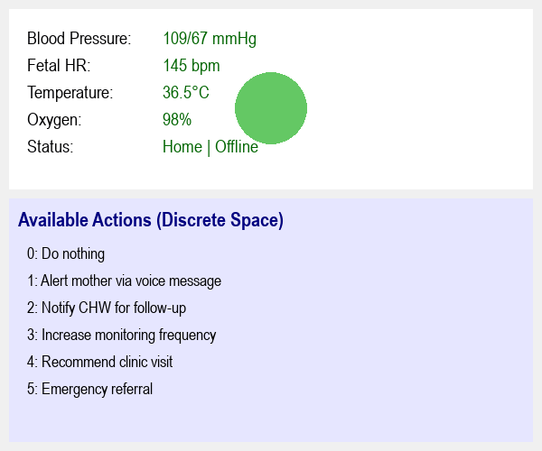

# Reinforcement Learning Summative Assignment Report  

## 1. Project Overview  
This project implements a reinforcement learning system for maternal health monitoring, where an AI agent makes critical healthcare decisions based on vital sign parameters. The environment simulates a patient's changing physiological states (heart rate, blood pressure, oxygen levels, etc.), and the agent must select optimal medical interventions. Two RL approaches were implemented: Deep Q-Networks (DQN) and Proximal Policy Optimization (PPO), with comparative analysis of their performance in this healthcare scenario.

## 2. Environment Description  

### 2.1 Agent(s)  
- **Medical Decision-Maker**: Single agent responsible for selecting patient interventions  
- **Capabilities**: Observes 5 vital sign parameters, chooses from 5 medical actions  
- **Limitations**: No long-term patient history, immediate state transitions  

### 2.2 Action Space  
Discrete Actions (5 options):  
- **0. Monitor**: Passive observation  
- **1. Alert the medical team**  
- **2. Recommend patient rest**  
- **3. Adjust wearable sensors**  
- **4. Emergency intervention**  

### 2.3 State Space  
5-Dimensional Feature Vector:  
1. **Heart Rate** (50-180 bpm) - Continuous  
2. **Blood Pressure** (80-180 mmHg) - Continuous  
3. **Fetal Movement** (0=Low, 1=Normal, 2=High) - Discrete  
4. **Oxygen Saturation** (80-100%) - Continuous  
5. **Time of Day** (0=Morning, 1=Afternoon, 2=Night) - Discrete  

